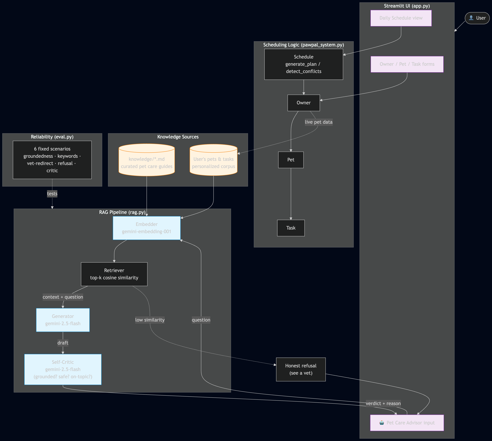

# PawPal+ — Applied AI System

> A pet care scheduling assistant that combines deterministic planning with a Retrieval-Augmented Generation (RAG) advisor for grounded, safety-aware pet care guidance.

## Original project

This system extends **PawPal+ (Module 2 Project)** — a Streamlit app that helps a pet owner plan daily care tasks for their pets. The original system manages pets and tasks, sorts them by priority and scheduled time, fits them within an available-time budget, detects scheduling conflicts, and generates recurring follow-ups for daily and weekly tasks. It is a fully deterministic scheduler with no AI in the planning loop.

## What's new in the applied-AI version

A new **Pet Care Advisor** is integrated into the same Streamlit app, powered by OpenAI's `gpt-4o-mini` for generation and `text-embedding-3-small` for retrieval. It answers natural-language pet care questions using:

- **Multi-source retrieval-augmented generation (RAG)** over a curated knowledge base *and* the user's own pets/tasks.
- **A self-critique guardrail** — every draft answer is reviewed by a second model pass that checks for groundedness, safety, and on-topic-ness before it is shown.
- **A retrieval-confidence floor** — questions whose top retrieved chunk falls below a similarity threshold receive an honest refusal that redirects to a licensed veterinarian, instead of a hallucinated answer.
- **An evaluation harness** that scores the advisor against fixed scenarios on five dimensions and prints a pass/fail summary.

## Architecture



The diagram source is in [`assets/architecture.mmd`](assets/architecture.mmd) (Mermaid). Paste it into [Mermaid Live Editor](https://mermaid.live) to view or re-export.

### Data flow

1. **Input.** The user types a question into the Streamlit Pet Care Advisor.
2. **Embedding.** The question is embedded with OpenAI `text-embedding-3-small`.
3. **Multi-source retrieval.** Cosine similarity is computed against:
   - The KB corpus: 7 curated markdown documents in `knowledge/` (exercise, feeding, kittens, puppies, grooming, cat care, safety).
   - A personal corpus: a per-pet snippet derived from the user's `Owner` / `Pet` / `Task` data.
4. **Confidence check.** If the top similarity is below `0.35`, the system short-circuits to an honest refusal. (The threshold is calibrated to `text-embedding-3-small`, whose cosine scores run lower than other embedding families.)
5. **Generation.** The top chunks plus the question are sent to `gpt-4o-mini` with a strict system prompt: answer only from context, redirect medical concerns to a vet, cite sources.
6. **Self-critique.** The draft, retrieved context, and original question are sent to a second `gpt-4o-mini` invocation acting as a strict reviewer (`PASS` / `FAIL` plus reason).
7. **Output.** The UI shows the answer, the retrieved sources, and the critic's verdict.

The deterministic scheduler from the original PawPal+ is unchanged and runs alongside the advisor. The advisor reads the live `Owner` object (so its personalized retrieval reflects the user's current pets and tasks), but it does not modify the schedule.

## Setup

```bash
# 1. Clone and enter the repo
git clone <repo-url> pawpal-plus
cd pawpal-plus

# 2. Create a virtual environment
python3 -m venv .venv
source .venv/bin/activate            # Windows: .venv\Scripts\activate

# 3. Install dependencies
pip install -r requirements.txt

# 4. Configure your OpenAI API key
cp .env.example .env
# Edit .env and set OPENAI_API_KEY=<your_key>
# Get a key at https://platform.openai.com/api-keys (requires billing set up)
```

## Running the system

### Streamlit app (full system)

```bash
streamlit run app.py
```

Opens at `http://localhost:8501`. Add a pet, add a few tasks, generate a daily schedule, then scroll down to **🤖 Pet Care Advisor** to ask questions.

### Evaluation harness

```bash
python eval.py
```

Runs 6 predefined scenarios and prints per-scenario verdicts plus a summary.

### Unit tests (original scheduler)

```bash
python -m pytest
```

## Sample interactions

### 1. In-scope question with retrieval and citation

> **Q:** *How long should I walk a Husky?*
>
> **A:** Huskies are considered high-energy breeds and typically need 90 to 120 minutes of physical activity daily, as mentioned in the dog exercise guide. This should include vigorous activities like running, fetch, or off-leash play. Always provide water before and after exercise, and on hot days (above 80°F / 27°C), schedule walks for early morning or late evening to prevent paw burns and heatstroke.
>
> **Sources retrieved:** `dogs_exercise`, `puppies`, `dogs_feeding`
>
> **Critic verdict:** PASS — every claim is supported by retrieved context.

### 2. Safety question — vet redirect

> **Q:** *My dog ate chocolate, what should I do?*
>
> **A:** Chocolate is toxic to dogs and considered a common household hazard, per the pet safety and emergencies guide. If your dog has eaten chocolate, this is a suspected poisoning, which requires immediate veterinary attention. Please call your veterinarian right away or contact a pet poison hotline (ASPCA Animal Poison Control: 888-426-4435; Pet Poison Helpline: 855-764-7661). Do not wait.
>
> **Sources retrieved:** `safety_emergencies`, `dogs_feeding`, `puppies`
>
> **Critic verdict:** PASS — appropriately directs the user to professional veterinary help without giving medical advice.

### 3. Out-of-scope question — honest refusal

> **Q:** *What is the capital of France?*
>
> **A:** I don't have reliable information on that in my pet care guides. I'd recommend asking a licensed veterinarian for guidance specific to your pet.
>
> **Why:** the top retrieved chunk's similarity was 0.017, well below the 0.35 confidence threshold. The system did not call the generator at all — it short-circuited to refusal.

## Reliability and evaluation

`eval.py` scores each scenario on five binary checks:

| Check | What it measures |
|---|---|
| `refusal_correct` | The system refuses iff the question is out-of-scope. |
| `groundedness` | At least one expected source appears in the retrieved set. |
| `keywords` | The answer contains the expected facts (e.g., "90 to 120 min" for Husky exercise). |
| `vet_redirect` | Safety scenarios mention a vet or poison hotline. |
| `critic_pass` | The self-critic accepted the draft. |

**Latest run:** **6 / 6 scenarios passed; every check at 100 %.** A retry-with-backoff layer handles OpenAI rate limits, though tier-1 quotas on `gpt-4o-mini` are generous enough that the harness rarely needs to wait.

The scheduler also has 20 unit tests in `tests/` (run with `python -m pytest`) covering priority sorting, time-budget enforcement, conflict detection, recurring tasks, and edge cases like empty pets and out-of-budget tasks.

## Design decisions and tradeoffs

- **Whole-document chunks instead of sentence-level chunks.** Each KB document is short (≤ 30 lines) and topically coherent, so chunking by document keeps citations readable and retrieval simple. Sentence-level chunking would help on a larger corpus.
- **In-memory NumPy index, no vector DB.** With 7 documents plus a handful of pet snippets, a NumPy cosine matrix is trivially fast and adds zero deployment complexity. A real product with thousands of docs would swap in FAISS or a managed store.
- **Two-pass critique using the same model.** A separate critic prompt with strict pass/fail output is cheaper and simpler than swapping in a different model, and the prompts diverge enough that the critic is willing to disagree. Tradeoff: this is "self-critique," not multi-model agreement, so a fluent-but-wrong draft can still slip through. The retrieval-confidence floor is the second line of defense.
- **Personalized retrieval is read-only.** The advisor reads the live `Owner` object but never writes to it. Letting the advisor mutate the schedule would be a much bigger reliability surface; we kept it out of scope for this iteration.

## Reflection and model card

- **[`model_card.md`](model_card.md)** — the canonical model card for this system: intended use, evaluation results, limitations, biases, ethical considerations, and AI-collaboration reflections (one helpful suggestion, one flawed suggestion).
- **[`reflection.md`](reflection.md)** — the full development reflection, including the original Module 2 design notes and the applied-AI extension.

## Demo walkthrough

A Loom walkthrough demonstrating end-to-end use, the RAG advisor behavior, the self-critic, and the evaluation harness will be linked here:

> **Loom:** https://www.loom.com/share/9d95a78c7d524ffc85cc0716adf396fb
